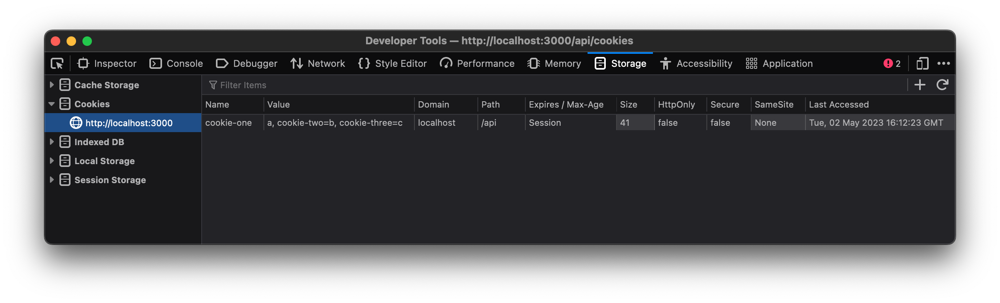

# Vercel Cookies MRE

Running `vercel dev` in Vercel CLI v28.20.0 - v29.x.x does not set multiple cookies correctly

## Steps to reproduce:

1. Install v28.20.0 of Vercel CLI: `npm i -g vercel@28.20.0` (also visible in v29+)
1. Run `vercel dev`
1. Visit http://localhost:3000/api/cookies
1. Open the browser’s web developer tools to view cookies
1. Delete any existing cookies and refresh the browser
1. The first cookie `name` is added with a combined value of the remaining cookies

```
cookie-one:"a, cookie-two=b, cookie-three=c"
```



## Expected result:

1. Install v28.19.0 of Vercel CLI: `npm i -g vercel@28.19.0`
1. Run `vercel dev`
1. Visit http://localhost:3000/api/cookies
1. Open the browser’s web developer tools to view cookies
1. Delete any existing cookies and refresh the browser
1. All three cookies are set correctly

```
cookie-one:"a"
cookie-two:"b"
cookie-three:"c"
```


